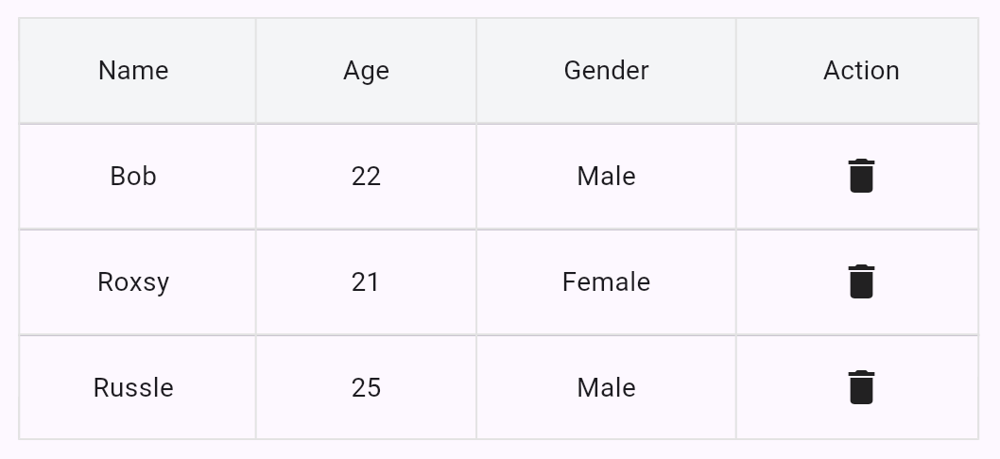
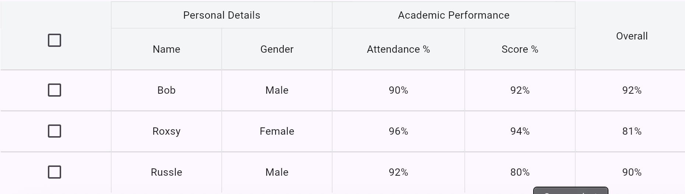
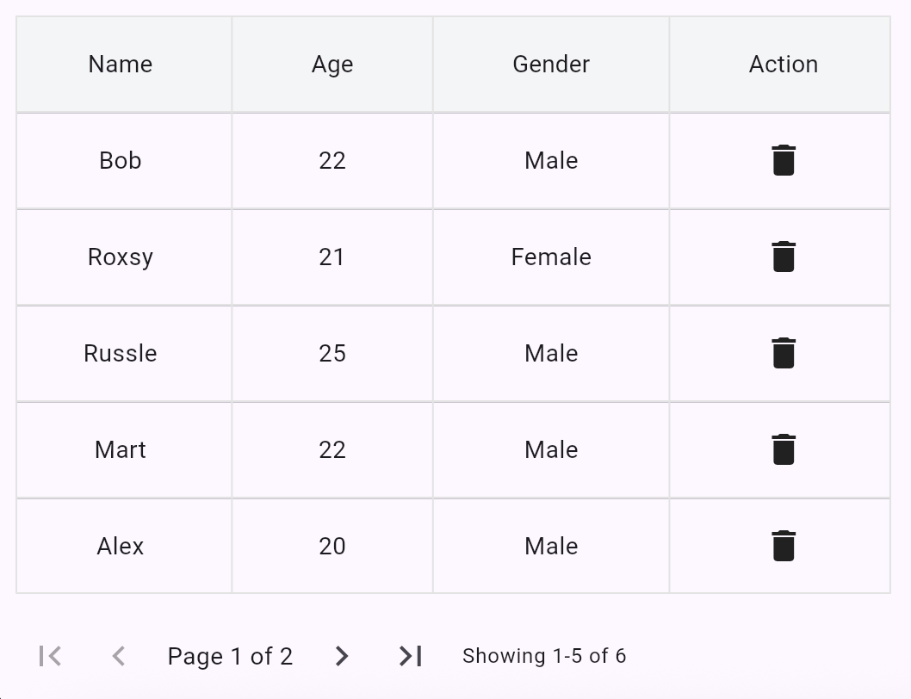

# NovaGrid

**NovaGrid** is a highly customizable and modern Flutter table package built to handle everything from simple data lists to advanced tables with stacked headers and pagination.

It is designed for Flutter web and desktop applications where native-feeling, interactive data tables are crucial.

---

## 📄 What It Is

NovaGrid is a flexible and extendable table widget:

* Customizable column definitions
* Fixed row height for consistent layouts
* Optional pagination
* Support for stacked (merged) headers
* Sortable columns
* Clean, professional UI
* Designed with accessibility and performance in mind

---

## ⚙️ Installation

Add the package to your `pubspec.yaml`:

```yaml
dependencies:
  nova_grid: ^0.0.2
```

Then run:

```bash
flutter pub get
```

---

## 📝 Basic Usage

```dart
NovaGrid(
  columns: [
    TableColumn(title: 'Name'),
    TableColumn(title: 'Age'),
    TableColumn(title: 'Role'),
  ],
  rows: [
    [Text('Alice'), Text('25'), Text('Engineer')],
    [Text('Bob'), Text('30'), Text('Designer')],
  ],
)
```

---

## 🔢 Example with Pagination and Stacked Headers

```dart
NovaGrid(
  columns: [
    TableColumn(
        title: 'Name', 
        width: 150, //width is mandatory for stacked headers
        isStacked: true, //Mark it true for stacked headers
        ),
    TableColumn(title: 'Age', width: 150, isStacked: true),
    TableColumn(
        title: 'Country', 
        width: 150, //Width is mandatory in stacked header tables even if its not marked as one
        ),
  ],
  rows: [...],
  showPagination: true,
  rowsPerPage: 10,
  stackedHeaders: [
    StackedHeader(
      startIndex: 0,
      endIndex: 1,
      title: 'Personal Info',
      width: 300, //Sum of the columns(TableColumn) widths which comes under this stacked header
    ),
  ],
)
```

---

## 📷 Screenshots
- Basic Table


- Stacked/Multi-Header Table


- Pagnated Table


---

## ✏️ Customization Options

| Property           | Type                   | Description                          |
| ------------------ | ---------------------- | ------------------------------------ |
| `columns`          | `List<TableColumn>`    | Defines each column header           |
| `rows`             | `List<List<Widget>>`   | Defines the cell contents            |
| `rowHeight`        | `double`               | Height of each row (default: 56)     |
| `rowsPerPage`      | `int?`                 | Optional pagination size             |
| `showPagination`   | `bool`                 | Whether to show pagination controls  |
| `headerColor`      | `Color?`               | Customize header background color    |
| `stackedHeaders`   | `List<StackedHeader>?` | Define merged headers across columns |
| `sortable`         | `bool`                 | Enable column sorting                |
| `emptyStateWidget` | `Widget?`              | Shown when rows are empty            |

---

## 🚀 Future Roadmap

* [ ] Sticky headers
* [ ] Export to CSV/Excel
* [ ] Auto Calculate width for stacked header table
* [ ] Async Pagnation
* [ ] In-build search filters

---

## 🌐 Metadata Files

### LICENSE (MIT)

```text
MIT License

Copyright (c) 2025
```

### CHANGELOG.md

```md
## 0.0.2
- Initial stable release
- Supports basic tables, pagination, inbuild column sorting and stacked headers 
```

## 🚀 Contributing

Pull requests are welcome. For major changes, please open an issue first to discuss what you would like to change.

---

## 🙏 Credits

Crafted with passion by \Haja Mohdn, powered by Flutter and lots of coffee.

<!-- --- -->

<!-- ## 🎓 License

This project is licensed under the MIT License - see the [LICENSE](LICENSE) file for details. -->

---

## ✨ Happy Coding!
